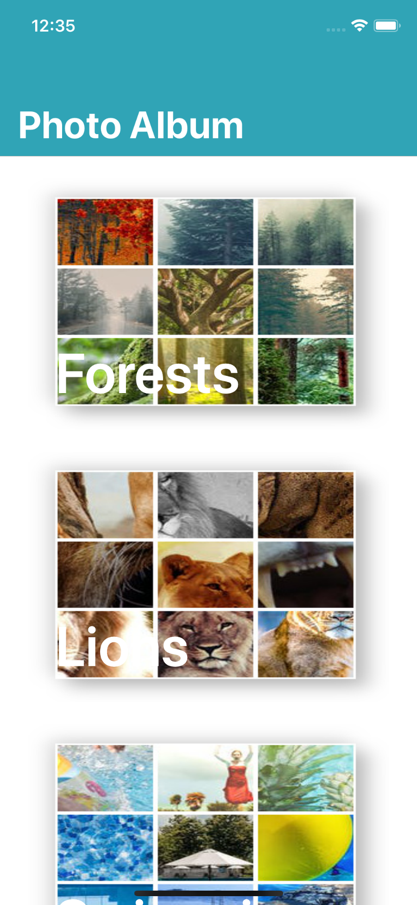
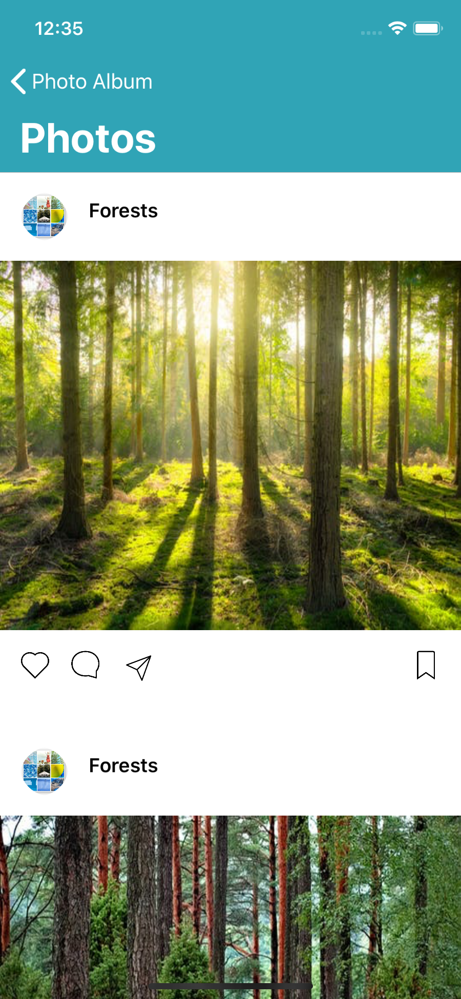
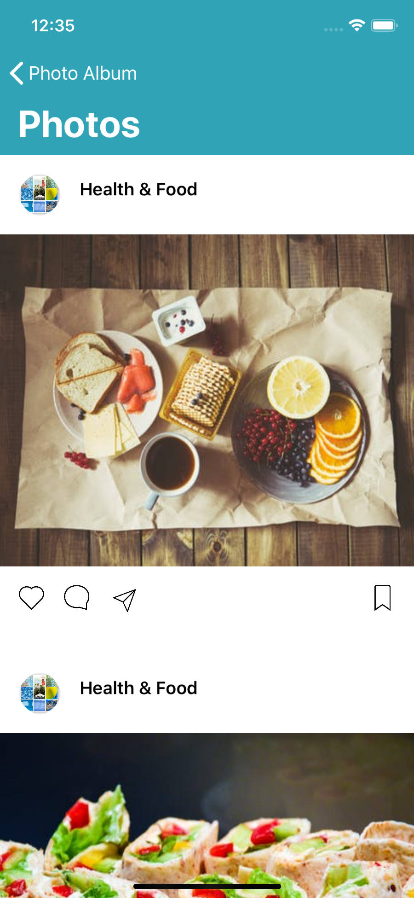
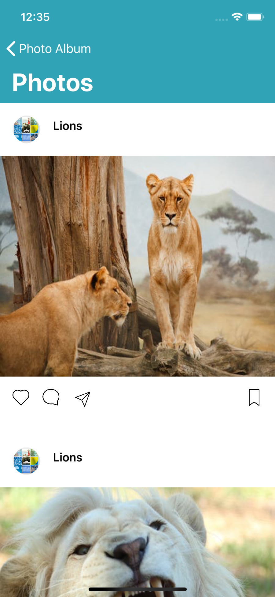

<<<<<<< HEAD
# iOS FileSystem Project
In this project we are going to be working with zip files, images and the files system. We are given a contract to develop an MVP for a image viewing app. The app should display a list of collages of images and when tapped, display all the images for a particular collection.

## Objectives
- [x] We should first hit the API do get the collections (https://s3-us-west-2.amazonaws.com/mob3/image_collection.json)
- [x] The json response has an array of collection with a url to a zip file for each collection.
- [x] We want to download the zip files and unzip them to a temporary store.
- [x] We want to display the preview images (_preview.png) and the name of the collection in a list
- [x] When a user taps a collection, we want to display the images for that collection.

## Screenshots

  
   
   
   
=======

# iOS FileSystem Project
In this project, I worked with zip files, images and the files system. I had to develop an MVP for a image viewing app. The app should display a list of collages of images and when tapped, display all the images for a particular collection.

## Objectives

- [x] First hit the API do get the collections (https://s3-us-west-2.amazonaws.com/mob3/image_collection.json)
- [x] The json response has an array of collection with a url to a zip file for each collection.
- [x] Download the zip files and unzip them to a temporary store.
- [x] Display the preview images (_preview.png) and the name of the collection in a list
- [x] When a user taps a collection, display the images for that collection.

## ScreenShots

  
  
  
  
>>>>>>> ef56ba300ebdebe14677ff6e64f6d4a2098c564c

